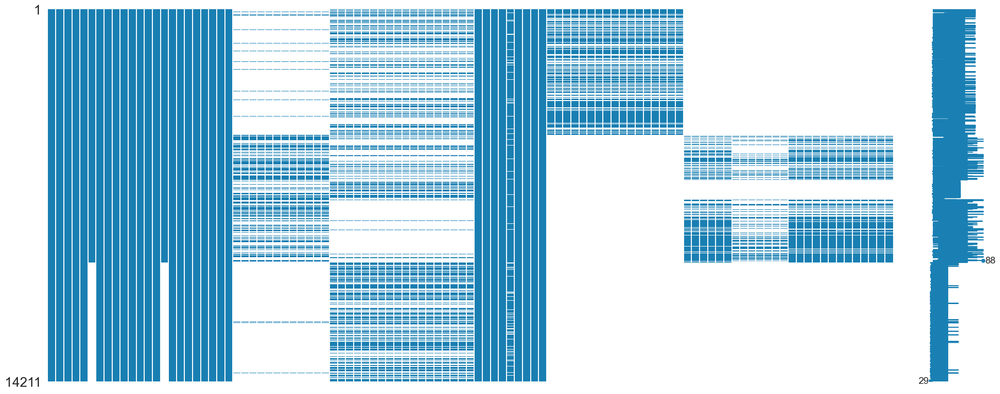
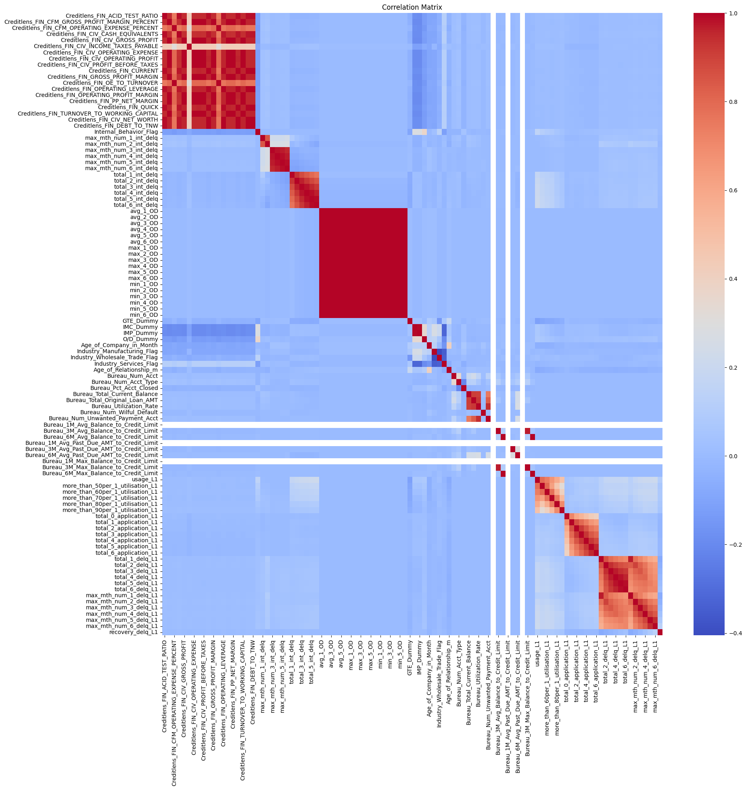
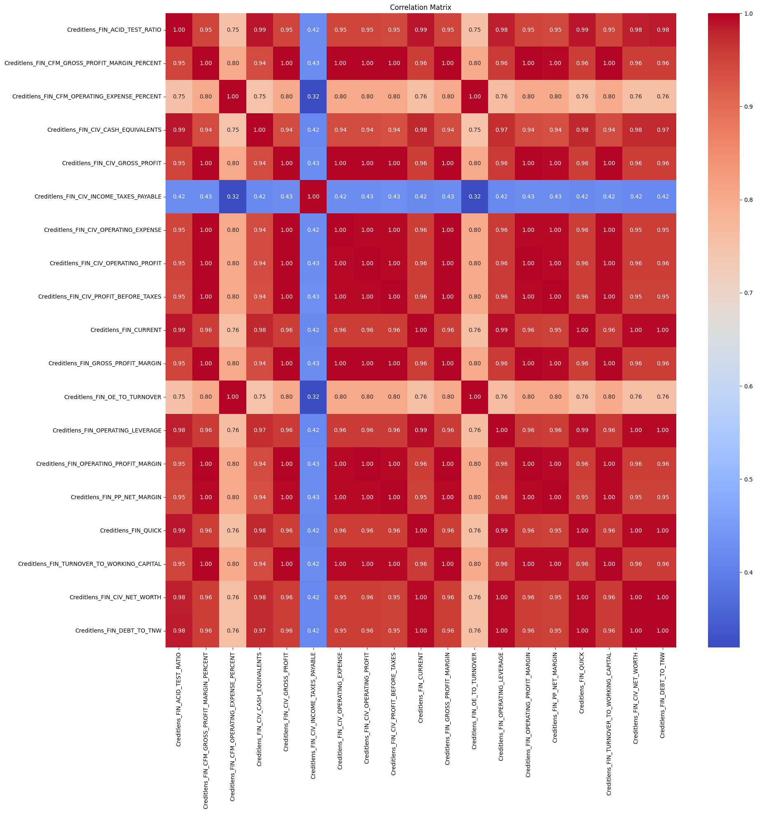
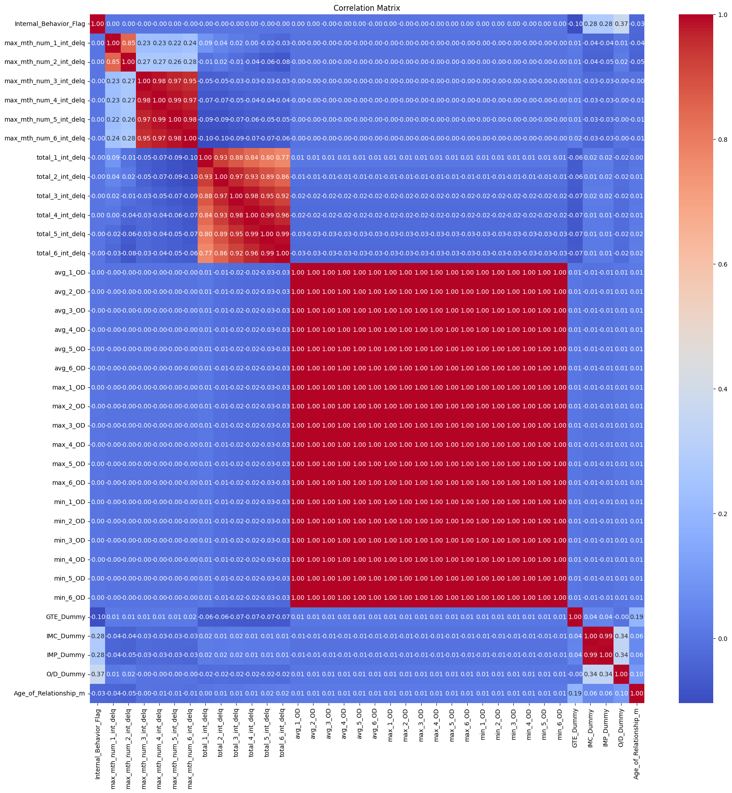
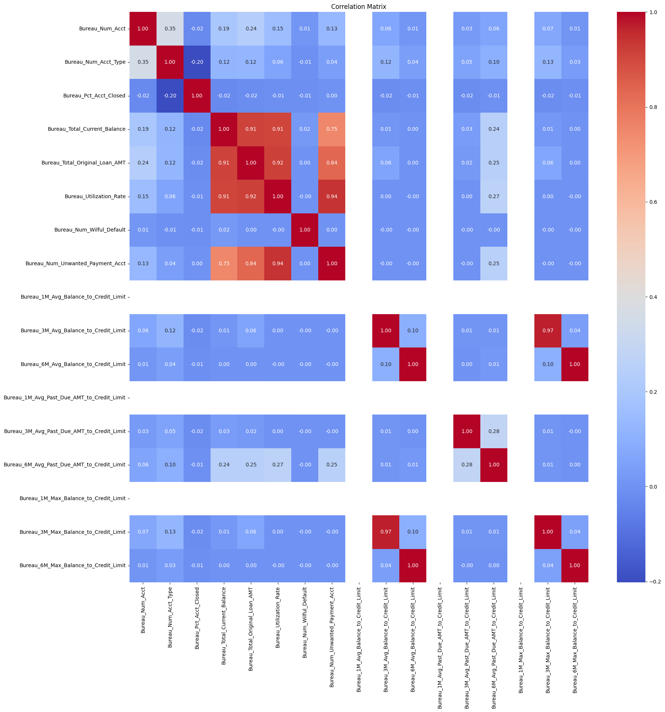
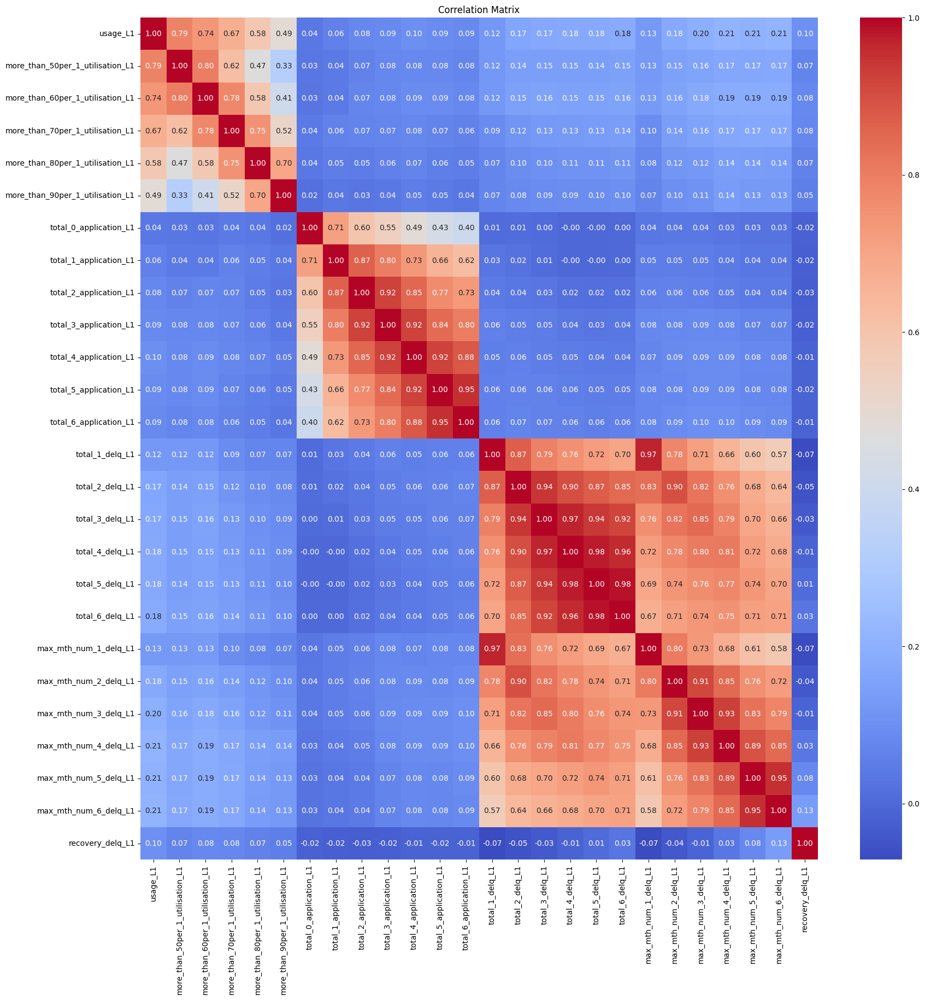
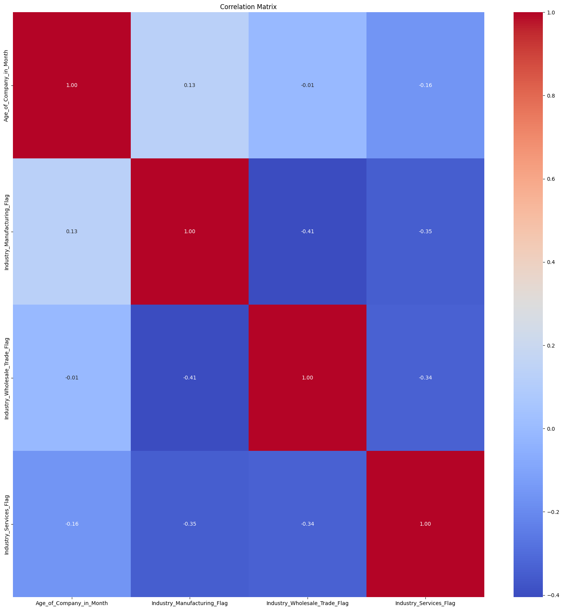
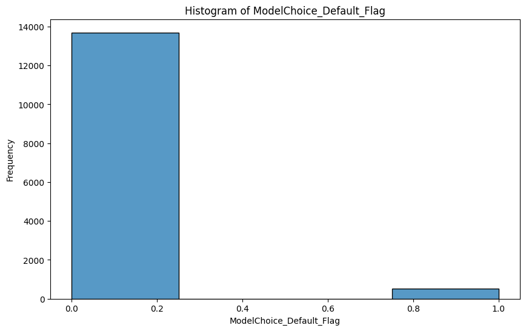

# MLF_Final_project
For MLF final project
## Team Member

Student Name | Student ID
:---------  | ---------
Yang Honggui| 2301212407
Chen Yichao| 2301212314

## Proposal: Credit Analysis of Module-based and Segment-based Data 
### Motivation
We know that machine learning can perform classification tasks well. In practical life, people often hope to predict specific situations through certain factors to determine their categories, such as having a series of characteristics of bank customers and determining whether they have defaulted.
### Goal  
1. Select which method to use.   

2. Compare different classifier model.

3. Use confusion matrix and Area under the ROC curve (AUC)

### Introduction
1. Segment-based data and Module-based data


2. Our Research Framework


### Data Processing
1. Select 102 features data from Transformed_data_v1.0_Final.csv. 

Our Dataset provided can be divided into 5 parts, which are Target Variable, Segment, Financial, Bureau, and Internal Behavior. For each category, we have listed some typical variables and their corresponding descriptions below that category.


2. Descriptive Analysis of Raw Data


3. The situation of missing data



The blue bar chart indicates missing factor data, and the longer the blue bar chart, the more missing factor data there is.


4. Correlation Matrix

The following paragraph shows six correlation matrix, the first paragraph contains all the factors, and the remaining five correlation matrices correspond to the five partitions of factors in method 3 (module based data model).

a. Correlation_all



b. Correlation_financial



c. Correlation_internal



d. Correlation_AA_only



e. Correlation_BB_only



f. Correlation_Segment



5. Oversampling

There is an imbalance in the sample of data.




Copy minority class samples to increase their quantity, matching them with the number of majority class samples, achieves a class balance.

6. Three Method

a. Full Data Model

Directly fill in all the values and construct the largest complete model.


b. Segment-based Data Model

Group them into different segments, and fill in missing values within each segment. The final prediction is also calculated based on different segments, including AA, BB, and VV.


c. Module-based Data Model

Begin by constructing models for variables within distinct 5 groups. After splitting factors, in each groups, constructing classifier model. For example, we need to integrate the models corresponding to the pink blocks in the row where AA is located to obtain the final prediction result. 

Therefore, 

AA_prediction= Financial_only + Internal_only + AA_only + Financial_only_for_VV,

BB_prediction= Financial_only + Internal_only + BB_only + Financial_only_for_VV

VV_prediction= Internal_only + Financial_only_for_VV


Splitting of Test Datasets


### Classifier Model We Use

We use pipeline to pack SimpleImputer, StandardScaler, and the following four models; then use gridsearch to find the optimal parameter. 


1. Logistic Regression Model

```python
    from sklearn.linear_model import LogisticRegression
    from sklearn.pipeline import Pipeline
    from sklearn.impute import SimpleImputer
    from sklearn.preprocessing import StandardScaler
    from sklearn.decomposition import PCA
    from sklearn.model_selection import GridSearchCV
    
    def bestCofLR(train_X, train_y, best_params=None, class_weight=None):
        # Define a pipeline that includes preprocessing and logistic regression
        pipeline = Pipeline([
            ('imputer', SimpleImputer(strategy='mean')),  # Handle missing values
            ('scaler', StandardScaler()),  # Data standardization
            ('pca', PCA()),  # Principal Component Analysis
            ('classifier', LogisticRegression())  # Logistic Regression classifier
        ])
        
        if best_params:
            # Check if each parameter value list in best_params only has one element
            if all(len(v) == 1 for v in best_params.values()):
                # If each list has only one value, then apply these parameters and train the model
                # Extract each parameter's single value from the list
                single_params = {k: v[0] for k, v in best_params.items()}
                if class_weight:
                    single_params['classifier__class_weight'] = class_weight  # Add class_weight
                pipeline.set_params(**single_params)
                pipeline.fit(train_X, train_y)
                print("Parameters used:", single_params)
                return pipeline
            else:
                # Use grid search
                param_grid = best_params
        else:
            # Define a parameter grid, searching both the number of PCA components and the C value for logistic regression
            param_grid = {
                'pca__n_components': [7, 9, 11, 13, 15, 17],
                'classifier__C': [0.0001, 0.001, 0.01]
            }
    
        if class_weight:
            param_grid['classifier__class_weight'] = [class_weight]
            
        # Create a GridSearchCV object based on the pipeline to conduct the parameter search
        grid_search = GridSearchCV(pipeline, param_grid, cv=5, scoring='f1')
    
        # Use the GridSearchCV object to train the model
        grid_search.fit(train_X, train_y)
    
        # Output the best parameter combination
        best_params = grid_search.best_params_
        print("Best parameters:", best_params)
    
        # Return the GridSearchCV object
        return grid_search

```

2. Random Forest Model

3. XGBOOST Model

4. LGB Model


In each model, we randomly select 80% as training set, 20% as test set.

### Result of Each Method and Evaluation 

1. Method 1: Full Data Model


2. Method 2: Segment-based Data Model


3. Method 3: Module-based Data Model


In the above three methods, the AUC of the classification results of the four models in each method is greater than 0.5, indicating that relatively good results have been achieved. However, the confusion matrix of each classification model is not ideal, and we speculate that it is a problem with the dataset itself. The ideal one is the Logistic Regression of Method 3, as our goal is to classify customers who were originally in breach as much as possible. If customers who are likely to default are not classified as such, it may result in more expensive costs for the company.
