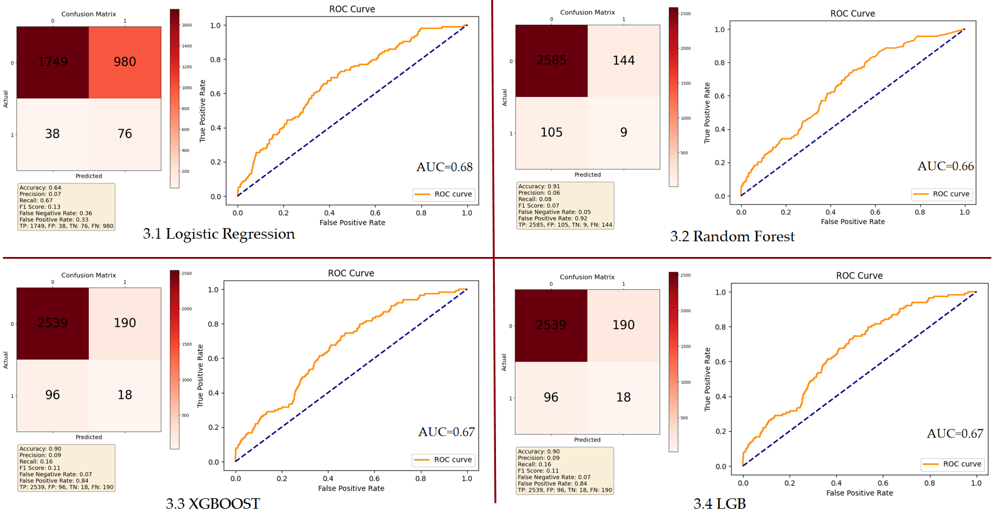

# MLF_Final_project
For MLF final project
## Proposal: Credit Analysis of Module-based and Segment-based Data 
### Motivation
We know that machine learning can perform classification tasks well. In practical life, people often hope to predict specific situations through certain factors to determine their categories, such as having a series of characteristics of bank customers and determining whether they have defaulted.
### Goal  
1. Select which method to use.   

2. Compare different classifier model.

3. Use confusion matrix and Area under the RUC curve (AUC)

### Introduction
1.Segment-based data and Module-based data

2.Our research framework

### Data Processing
1.Select 102 features data from Transformed_data_v1.0_Final.csv. 

2.Descriptive Analysis of Raw Data

3.The situation of missing data

The blue bar chart indicates missing factor data, and the longer the blue bar chart, the more missing factor data there is.

4.Oversampling

Copy minority class samples to increase their quantity, matching them with the number of majority class samples, achieves a class balance.

5.Three Method

a.Full Data Model

Directly fill in all the values and construct the largest complete model.

b.Segment-based Data Model

Group them into different segments, and fill in missing values within each segment. The final prediction is also calculated based on different segments, including AA, BB, and VV.

c.Module-based Data Model

Begin by constructing models for variables within distinct 5 groups. After splitting factors, in each groups, constructing classifier model. For example, we need to integrate the models corresponding to the pink blocks in the row where AA is located to obtain the final prediction result. 

Therefore, 

AA_prediction= Financial_only + Internal_only + AA_only + Financial_only_for_VV,

BB_prediction= Financial_only + Internal_only + BB_only + Financial_only_for_VV

VV_prediction= Internal_only + Financial_only_for_VV

Splitting of Test Datasets

### Classifier Model We Use

1.Logistic Regression Model

2.Random Forest Model

3.XGBOOST Model

4.LGB Model

In each model, we randomly select 80% as training set, 20% as test set.

### Result of Each Method and Evaluation 

1.Method 1: Full Data Model

2.Method 2: Segment-based Data Model

3.Method 3: Module-based Data Model

In the above three methods, the AUC of the classification results of the four models in each method is greater than 0.5, indicating that relatively good results have been achieved. However, the confusion matrix of each classification model is not ideal, and we speculate that it is a problem with the dataset itself. The ideal one is the Logistic Regression of Method 3, as our goal is to classify customers who were originally in breach as much as possible. If customers who are likely to default are not classified as such, it may result in more expensive costs for the company.
