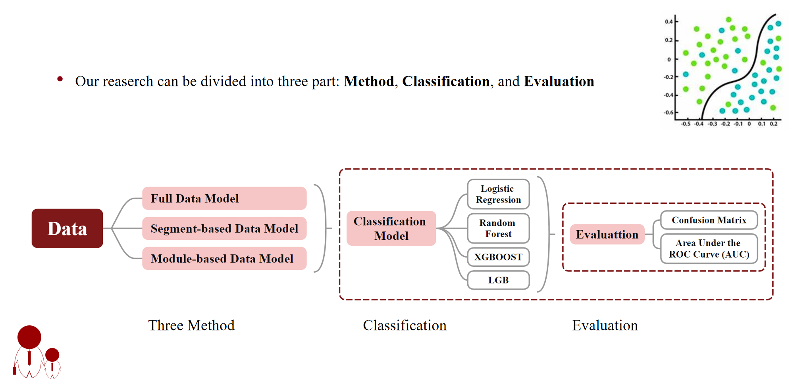
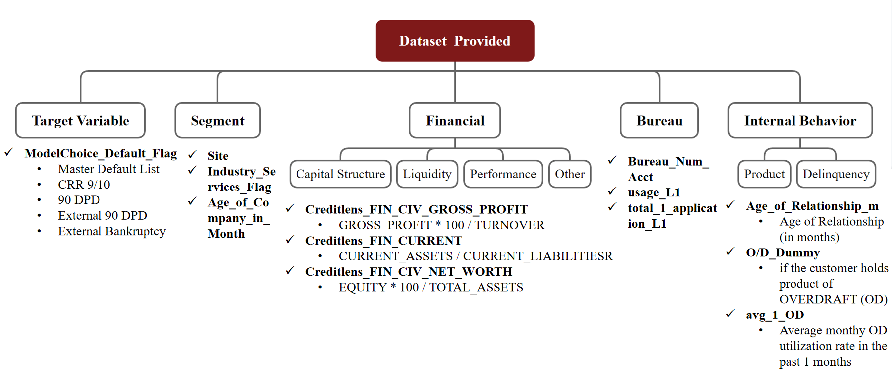

# MLF_Final_project
For MLF final project
## Proposal: Credit Analysis of Module-based and Segment-based Data 
### Motivation
We know that machine learning can perform classification tasks well. In practical life, people often hope to predict specific situations through certain factors to determine their categories, such as having a series of characteristics of bank customers and determining whether they have defaulted.
### Goal  
1. Select which method to use.   

2. Compare different classifier model.

3. Use confusion matrix and Area under the RUC curve (AUC)

### Introduction
1. Segment-based data and Module-based data


2. Our Research Framework



### Data Processing
1. Select 102 features data from Transformed_data_v1.0_Final.csv. 

Our Dataset provided can be divided into 5 part, which are Target Variable, Segment, Financial, Bureau, and Internal Behavior. For each category, we have listed some typical variables and their corresponding descriptions below that category.



2. Descriptive Analysis of Raw Data


3. The situation of missing data


The blue bar chart indicates missing factor data, and the longer the blue bar chart, the more missing factor data there is.

4. Oversampling


Copy minority class samples to increase their quantity, matching them with the number of majority class samples, achieves a class balance.

5. Three Method

a. Full Data Model

Directly fill in all the values and construct the largest complete model.


b. Segment-based Data Model

Group them into different segments, and fill in missing values within each segment. The final prediction is also calculated based on different segments, including AA, BB, and VV.


c. Module-based Data Model

Begin by constructing models for variables within distinct 5 groups. After splitting factors, in each groups, constructing classifier model. For example, we need to integrate the models corresponding to the pink blocks in the row where AA is located to obtain the final prediction result. 

Therefore, 

AA_prediction= Financial_only + Internal_only + AA_only + Financial_only_for_VV,

BB_prediction= Financial_only + Internal_only + BB_only + Financial_only_for_VV

VV_prediction= Internal_only + Financial_only_for_VV


Splitting of Test Datasets


### Classifier Model We Use

We use pipeline to pack SimpleImputer, StandardScaler, and the following four models; then use gridsearch to find the optimal parameter. 


1. Logistic Regression Model

```python
    from sklearn.linear_model import LogisticRegression
    from sklearn.pipeline import Pipeline
    from sklearn.impute import SimpleImputer
    from sklearn.preprocessing import StandardScaler
    from sklearn.decomposition import PCA
    from sklearn.model_selection import GridSearchCV

    def bestCofLR(train_X, train_y, best_params = None, class_weight=None):
        # 定义一个 pipeline，其中包含预处理和逻辑回归
        pipeline = Pipeline([
            ('imputer', SimpleImputer(strategy='mean')),  # 缺失值处理
            ('scaler', StandardScaler()),  # 数据标准化
            ('pca', PCA()),  # 主成分分析
            ('classifier', LogisticRegression())  # 逻辑回归分类器
        ])
        if best_params:
            # 检查 best_params 中的每个参数值列表是否只有一个元素
            if all(len(v) == 1 for v in best_params.values()):
                # 如果每个列表只有一个值，则应用这些参数并训练模型
                # 需要从列表中提取每个参数的单个值
                single_params = {k: v[0] for k, v in best_params.items()}
                if class_weight:
                    single_params['classifier__class_weight'] = class_weight  # 添加 class_weight
                pipeline.set_params(**single_params)
                pipeline.fit(train_X, train_y)
                print("Parameters used:", single_params)
                return pipeline
            else:
                # 使用网格搜索
                param_grid = best_params
        else:
            # 定义参数网格，同时搜索 PCA 的组件数和逻辑回归的 C 值
            param_grid = {
                'pca__n_components': [7, 9, 11, 13, 15, 17],
                'classifier__C': [0.0001, 0.001, 0.01]
            }

        if class_weight:
            param_grid['classifier__class_weight'] = [class_weight]
            
        # 创建一个 GridSearchCV 对象，以 pipeline 为基础进行参数搜索
        grid_search = GridSearchCV(pipeline, param_grid, cv=5, scoring='f1')

        # 使用 GridSearchCV 对象训练模型
        grid_search.fit(train_X, train_y)

        # 输出最优的参数组合
        best_params = grid_search.best_params_
        print("Best parameters:", best_params)

        # 返回 GridSearchCV 对象、准确率、预测结果和预测概率
        return grid_search

2. Random Forest Model

3. XGBOOST Model

4. LGB Model


In each model, we randomly select 80% as training set, 20% as test set.

### Result of Each Method and Evaluation 

1. Method 1: Full Data Model


2. Method 2: Segment-based Data Model


3. Method 3: Module-based Data Model


In the above three methods, the AUC of the classification results of the four models in each method is greater than 0.5, indicating that relatively good results have been achieved. However, the confusion matrix of each classification model is not ideal, and we speculate that it is a problem with the dataset itself. The ideal one is the Logistic Regression of Method 3, as our goal is to classify customers who were originally in breach as much as possible. If customers who are likely to default are not classified as such, it may result in more expensive costs for the company.
